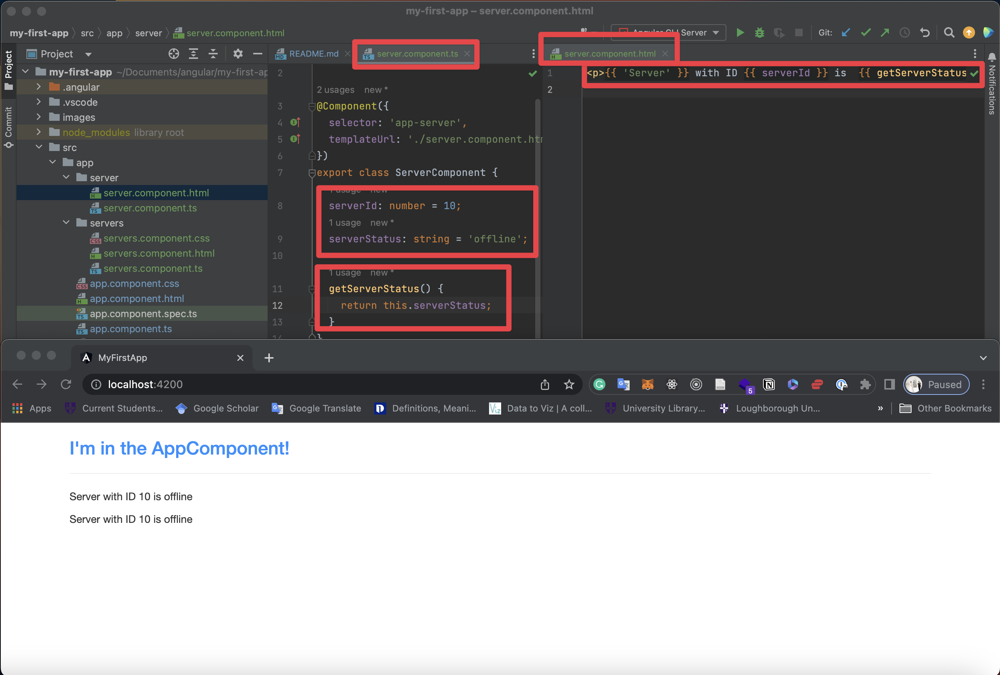

# Section 1: Getting Started

This project was generated with [Angular CLI](https://github.com/angular/angular-cli) version 15.1.5.

## Project Setup and First app

Run `ng serve` for a dev server. Navigate to `http://localhost:4200/`. The application will automatically reload if you change any of the source files.


## A basic project setup using Bootstrap for styling

```shell
npm install --save bootstrap@3
```


## How an Angular App gets loaded and started


## Components are important
Components are the main building block for Angular applications. Each component consists of:

- An HTML template that declares what renders on the page
- A TypeScript class that defines behavior
- A CSS selector that defines how the component is used in a template
- Optionally, CSS styles applied to the template


## Creating a New Component
- Create the new folder (app/server)
- Create the file (server.component.ts)


## Understanding the role of AppModule and Component


## Using Custom Components


## Creating components with the CLI & Nesting Components
```shell
ng generate component servers
ng g c servers
```


## Working with component templates


## Working with Component styles


## Fully understanding the Component Selector


## What is Databinding?


## String Interpolation


## Property Binding
Property binding is a one-way mechanism that lets you set the property of a view element. It involves updating the value of a property in the component and binding it to an element in the view template.


## Property Binding vs String Interpolation


## Event Binding


## Bindable Properties and Events
How do you know to which Properties or Events of HTML Elements you may bind? You can basically bind to all Properties and Events - a good idea is to console.log()  the element you're interested in to see which properties and events it offers.

Important: For events, you don't bind to onclick but only to click (=> (click)).

The MDN (Mozilla Developer Network) offers nice lists of all properties and events of the element you're interested in. Googling for YOUR_ELEMENT properties  or YOUR_ELEMENT events  should yield nice results.

## Passing and Using Data with Event Binding


## Important: FormsModule is required for Two-Way-Binding
Important: For Two-Way-Binding (covered in the next lecture) to work, you need to enable the ngModel  directive. This is done by adding the FormsModule  to the imports[]  array in the AppModule.

You then also need to add the import from @angular/forms  in the app.module.ts file:

import { FormsModule } from '@angular/forms'; 

## Two-Way-Databinding


## Combining all Forms of Databinding


## What are Directives?

Directives are Instructions in the DOM!

Directives are classes that add new behavior or modify the existing behavior to the elements in the template.

Basically directives are used to manipulate the DOM, for example adding/removing the element from DOM or changing the appearance of the DOM elements.

- Types of directives

1. Component directive
Components are special directives in Angular. They are the directive with a template

It might confuse you a bit, but if you see the definition of the directive, it says directives are used to manipulate the DOM, so now if you think what component is doing, it is actually showing something in DOM, hence we can say component is also a directive with a template (template or templateUrls).

2. Structural directive
Structural directives are used to change the DOM layout by adding and removing DOM elements. It basically changes the structure of the DOM
Examples of structural directives are ngIf, ngFor, ngSwitch.

*ngIf — adds or removes element from DOM.
*ngFor — renders list of elements on every iteration.

All structural Directives are preceded by Asterix (*)symbol.

3. Attribute directive
Attribute directives are used to change the appearance or behavior of an element.

Examples of attributes directives are ngStyle, ngClass, ngModel

ngStyle — used to apply styles that will change the appearance.
ngClass — used to apply CSS classes to change the appearance.

## Using nglf to Output Data Conditionally


## Enhancing nglf with an Else Condition


## Styling Elements Dynamically with ngStyle
Unlike structural directives, attribute directives don't add or remove elements. They only change the element they were placed on.


## Applying CSS Classes Dynamically with ngClass


## Outputting Lists with ngFor


